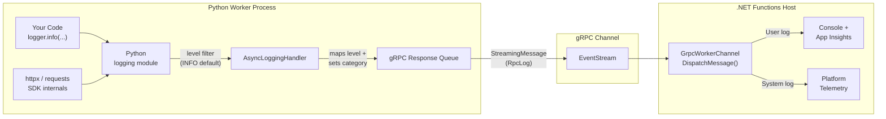

<!--
---
name: Azure Functions Python HTTP Trigger using Azure Developer CLI
description: This repository contains an Azure Functions HTTP trigger quickstart written in Python and deployed to Azure Functions Flex Consumption using the Azure Developer CLI (azd). The sample uses managed identity and a virtual network to make sure deployment is secure by default. You can opt out of a VNet being used in the sample by setting VNET_ENABLED to false in the parameters.
page_type: sample
languages:
- azdeveloper
- python
- bicep
products:
- azure
- azure-functions
- entra-id
urlFragment: functions-quickstart-python-azd
---
-->

# Azure Functions Python HTTP Trigger using Azure Developer CLI

This template repository contains an HTTP trigger reference sample for Azure Functions written in Python and deployed to Azure using the Azure Developer CLI (`azd`). The sample uses managed identity and a virtual network to make sure deployment is secure by default.

This source code supports the article [Quickstart: Create and deploy functions to Azure Functions using the Azure Developer CLI](https://learn.microsoft.com/azure/azure-functions/create-first-function-azure-developer-cli?pivots=programming-language-python).

## Prerequisites

+ [Python 3.11](https://www.python.org/)
+ [Azure Functions Core Tools](https://learn.microsoft.com/azure/azure-functions/functions-run-local?pivots=programming-language-python#install-the-azure-functions-core-tools)
+ [Azure Developer CLI (AZD)](https://learn.microsoft.com/azure/developer/azure-developer-cli/install-azd)
+ To use Visual Studio Code to run and debug locally:
  + [Visual Studio Code](https://code.visualstudio.com/)
  + [Azure Functions extension](https://marketplace.visualstudio.com/items?itemName=ms-azuretools.vscode-azurefunctions)

## Initialize the local project

You can initialize a project from this `azd` template in one of these ways:

+ Use this `azd init` command from an empty local (root) folder:

    ```shell
    azd init --template functions-quickstart-python-http-azd
    ```

    Supply an environment name, such as `flexquickstart` when prompted. In `azd`, the environment is used to maintain a unique deployment context for your app.

+ Clone the GitHub template repository locally using the `git clone` command:

    ```shell
    git clone https://github.com/Azure-Samples/functions-quickstart-python-http-azd.git
    cd functions-quickstart-python-http-azd
    ```

    You can also clone the repository from your own fork in GitHub.

## Prepare your local environment

Add a file named `local.settings.json` in the root of your project with the following contents:

```json
{
    "IsEncrypted": false,
    "Values": {
    "AzureWebJobsStorage": "UseDevelopmentStorage=true",
    "FUNCTIONS_WORKER_RUNTIME": "python",
    "LOGLEVEL_HTTPX": "INFO",
    "LOGLEVEL_REQUESTS": "INFO"
    }
}
```

## Create a virtual environment

The way that you create your virtual environment depends on your operating system.
Open the terminal, navigate to the project folder, and run these commands:

### Linux/macOS/bash

```bash
python -m venv .venv
source .venv/bin/activate
```

#### Windows (Cmd)

```shell
py -m venv .venv
.venv\scripts\activate
```

## Run your app from the terminal

1. To start the Functions host locally, run these commands in the virtual environment:

    ```shell
    pip3 install -r requirements.txt
    func start
    ```

1. From your HTTP test tool in a new terminal (or from your browser), call the HTTP GET endpoint: <http://localhost:7071/api/httpget>

1. Test the HTTP POST trigger with a payload using your favorite secure HTTP test tool. This example uses the `curl` tool with payload data from the [`testdata.json`](./testdata.json) project file:

    ```shell
    curl -i http://localhost:7071/api/httppost -H "Content-Type: text/json" -d @testdata.json
    ```

1. When you're done, press Ctrl+C in the terminal window to stop the `func.exe` host process.

1. Run `deactivate` to shut down the virtual environment.

## Run your app using Visual Studio Code

1. Open the root folder in a new terminal.
1. Run the `code .` code command to open the project in Visual Studio Code.
1. Press **Run/Debug (F5)** to run in the debugger. Select **Debug anyway** if prompted about local emulator not running.
1. Send GET and POST requests to the `httpget` and `httppost` endpoints respectively using your HTTP test tool (or browser for `httpget`). If you have the [RestClient](https://marketplace.visualstudio.com/items?itemName=humao.rest-client) extension installed, you can execute requests directly from the [`test.http`](test.http) project file.

## Source Code

The source code for both functions is in the [`function_app.py`](./function_app.py) code file, with reusable logging configuration in [`log_setup.py`](./log_setup.py).

### Logging

#### How logging works in Azure Functions (Python)

Python Azure Functions use an **out-of-process worker model**. Your Python code does **not** run inside the .NET Functions host — it runs in a separate Python process that communicates with the host over a **bidirectional gRPC stream**.



Here's what happens when you call `logger.info("hello")`:

1. **Python `logging` module** — Your log record hits the standard Python logging pipeline. Level filtering happens here first — if a logger is set to `WARNING`, your `INFO` message is **dropped immediately** and never leaves the Python process.

2. **`AsyncLoggingHandler`** — The Python worker installs its own `logging.Handler` on the root logger at startup ([source: `dispatcher.py`](https://github.com/Azure/azure-functions-python-worker/blob/main/azure_functions_worker/dispatcher.py)). This handler captures every log record that passes the level filter.

3. **Level & category mapping** — The handler maps Python log levels to the gRPC `RpcLog.Level` enum (`DEBUG`→`Debug`, `INFO`→`Information`, `WARNING`→`Warning`, etc.) and classifies the log as **User** or **System** based on the logger name. Loggers named `azure_functions_worker.*` or `azure.functions.*` are System; everything else is User.

4. **gRPC transport** — The `RpcLog` protobuf message is sent to the .NET host via the `FunctionRpc/EventStream` bidirectional stream.

5. **.NET host routing** — The host's `GrpcWorkerChannel` dispatches the message:
   - **User logs** → your configured `ILogger` sinks (local console, Application Insights)
   - **System logs** → platform telemetry only (you won't see these in App Insights)

#### Why logging must be configured in Python

Because filtering happens **before** the gRPC hop, configuring log levels in the Python code is essential:

- **The Python worker sets the root logger to `INFO` by default.** Any `DEBUG` messages are discarded in the Python process — the .NET host never sees them. That's why `log_setup.py` lets you set `LOG_LEVEL=DEBUG` to change this.

- **Noisy libraries flood the gRPC channel.** Libraries like the Azure SDK, httpx, and urllib3 emit verbose logs at `DEBUG`/`INFO`. Without suppressing them in Python, every single log record would be serialized to protobuf, sent over gRPC, deserialized in C#, and pushed to Application Insights — wasting CPU, network, and ingestion cost. That's why `log_setup.py` sets these to `WARNING` by default.

- **Logger names determine visibility.** If you accidentally use a logger named `azure.functions.something`, your logs get classified as System logs and won't appear in your Application Insights. Using your own logger name (like `function_app`) ensures they're treated as User logs.

- **`LOGLEVEL_` overrides give runtime control** without code changes — dial up `LOGLEVEL_HTTPX=DEBUG` to troubleshoot HTTP issues, then set it back to `WARNING` in production.

#### Setup

The project includes a structured logging setup ([`log_setup.py`](./log_setup.py)) that is initialized once at the top of `function_app.py`:

```python
from log_setup import setup_logging
logger = setup_logging("function_app")
```

This configures the root logger with a clean format, silences noisy library loggers (Azure SDK, httpx, gRPC, etc.) to WARNING by default, and returns a ready-to-use logger.

#### General environment variables

| Variable | Default | Description |
|---|---|---|
| `LOG_LEVEL` | `INFO` | Root log level for your application code |
| `LOG_FORMAT` | `%(asctime)s [%(levelname).1s] %(name)s: %(message)s` | Log format string |
| `LOG_DATE_FORMAT` | `%H:%M:%S` | Date format string |

#### Per-logger level overrides (`LOGLEVEL_`)

You can override the log level of any Python logger at runtime using environment variables with the `LOGLEVEL_` prefix. The convention is:

```
LOGLEVEL_<LOGGER_NAME>=<LEVEL>
```

- **Underscores become dots** in the logger name (e.g. `AZURE_CORE` → `azure.core`)
- **Case-insensitive** for both name and level
- **Valid levels:** `DEBUG`, `INFO`, `WARNING`, `ERROR`, `CRITICAL`
- **Invalid values** emit a Python warning and are skipped

Examples:

| Environment variable | Effect |
|---|---|
| `LOGLEVEL_HTTPX=INFO` | Sets `httpx` logger to INFO |
| `LOGLEVEL_REQUESTS=DEBUG` | Sets `requests` logger to DEBUG |
| `LOGLEVEL_AZURE_CORE=WARNING` | Sets `azure.core` logger to WARNING |
| `LOGLEVEL_AZURE_STORAGE_BLOB=ERROR` | Sets `azure.storage.blob` logger to ERROR |

These overrides have the highest priority — they are applied after the built-in noisy-logger defaults, so you can always dial up verbosity for debugging and dial it back down for production.

For local development, set them in `local.settings.json`:

```json
{
    "IsEncrypted": false,
    "Values": {
        "AzureWebJobsStorage": "UseDevelopmentStorage=true",
        "FUNCTIONS_WORKER_RUNTIME": "python",
        "LOGLEVEL_HTTPX": "INFO",
        "LOGLEVEL_REQUESTS": "INFO"
    }
}
```

For Azure deployments, the same variables are configured as app settings in [`infra/main.bicep`](./infra/main.bicep).

### HTTP requests with httpx and requests

The `httpget` function includes demo HTTP calls using both [httpx](https://www.python-httpx.org/) and [requests](https://docs.python-requests.org/) to compare logging behaviour side by side:

```python
# httpx
with httpx.Client(timeout=5) as client:
    resp = client.get(url)
    logger.info("httpx  %s → %s", url, resp.status_code)

# requests
resp = requests.get(url, timeout=5)
logger.info("requests %s → %s", url, resp.status_code)
```

Use `LOGLEVEL_HTTPX=DEBUG` or `LOGLEVEL_REQUESTS=DEBUG` to see detailed internal logs from each library.

### Function endpoints

This code shows an HTTP GET triggered function:  

```python
@app.route(route="httpget", methods=["GET"])
def http_get(req: func.HttpRequest) -> func.HttpResponse:
    name = req.params.get("name", "World")

    logger.info(f"Processing GET request. Name: {name}")

    return func.HttpResponse(f"Hello, {name}!")
```

This code shows an HTTP POST triggered function:

```python
@app.route(route="httppost", methods=["POST"])
def http_post(req: func.HttpRequest) -> func.HttpResponse:
    try:
        req_body = req.get_json()
        name = req_body.get('name')
        age = req_body.get('age')
        
        logger.info(f"Processing POST request. Name: {name}")

        if name and isinstance(name, str) and age and isinstance(age, int):
            return func.HttpResponse(f"Hello, {name}! You are {age} years old!")
        else:
            return func.HttpResponse(
                "Please provide both 'name' and 'age' in the request body.",
                status_code=400
            )
    except ValueError:
        return func.HttpResponse(
            "Invalid JSON in request body",
            status_code=400
        )
```

## Deploy to Azure

Run this command to provision the function app, with any required Azure resources, and deploy your code:

```shell
azd up
```

By default, this sample deploys with a virtual network (VNet) for enhanced security, ensuring that the function app and related resources are isolated within a private network. 
The `VNET_ENABLED` parameter controls whether a VNet is used during deployment:
- When `VNET_ENABLED` is `true` (default), the function app is deployed with a VNet for secure communication and resource isolation.
- When `VNET_ENABLED` is `false`, the function app is deployed without a VNet, allowing public access to resources.

This parameter replaces the previous `SKIP_VNET` parameter. If you were using `SKIP_VNET` in earlier versions, set `VNET_ENABLED` to `false` to achieve the same behavior.

To disable the VNet for this sample, set `VNET_ENABLED` to `false` before running `azd up`:
```bash
azd env set VNET_ENABLED false
azd up
```

You're prompted to supply these required deployment parameters:

| Parameter | Description |
| ---- | ---- |
| _Environment name_ | An environment that's used to maintain a unique deployment context for your app. You aren't prompted when you created the local project using `azd init`.|
| _Azure subscription_ | Subscription in which your resources are created.|
| _Azure location_ | Azure region in which to create the resource group that contains the new Azure resources. Only regions that currently support the Flex Consumption plan are shown.|

To learn how to obtain your new function endpoints in Azure along with the required function keys, see [Invoke the function on Azure](https://learn.microsoft.com/azure/azure-functions/create-first-function-azure-developer-cli?pivots=programming-language-java#invoke-the-function-on-azure) in the companion article [Quickstart: Create and deploy functions to Azure Functions using the Azure Developer CLI](https://learn.microsoft.com/azure/azure-functions/create-first-function-azure-developer-cli?pivots=programming-language-java#invoke-the-function-on-azure).

## Redeploy your code

You can run the `azd up` command as many times as you need to both provision your Azure resources and deploy code updates to your function app.

>[!NOTE]
>Deployed code files are always overwritten by the latest deployment package.

## Clean up resources

When you're done working with your function app and related resources, you can use this command to delete the function app and its related resources from Azure and avoid incurring any further costs:

```shell
azd down
```
